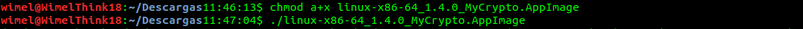
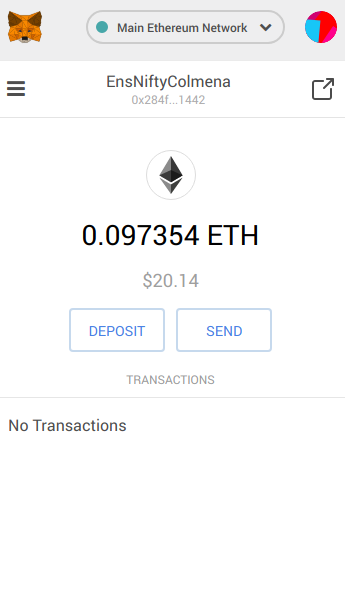
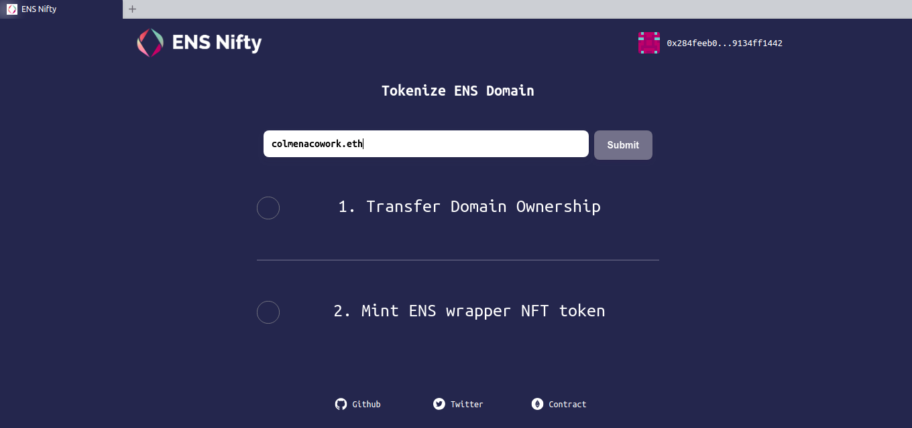
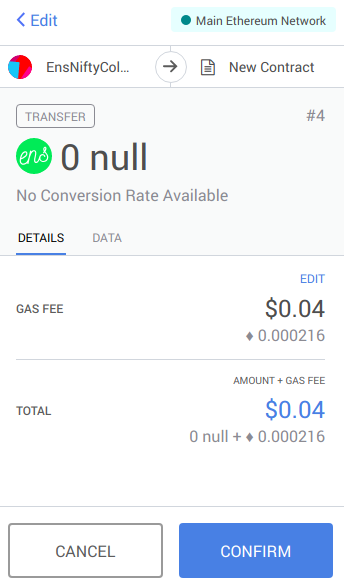
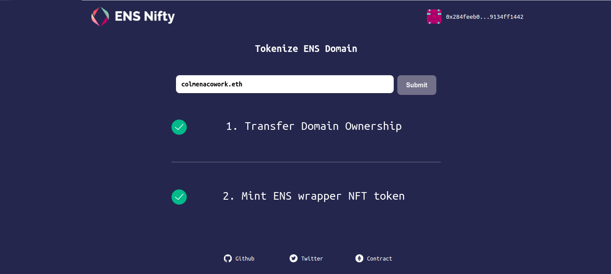

## ENS meetup Ethereum Sevilla
Repositorio para el workshop del [meetup de Ethereum Sevilla](https://secure.meetup.com/es/register/?ctx=ref) sobre [ENS](https://ens.domains/), y como tokenizar nuestro dominio con [ENS Nifty](https://ensnifty.com/), asi podemos intercambiar el dominio o delegarlo a otra wallet.

> (La parte de usar la App de MyCrypto es opcional, podemos usar cualquier gestor de carteras de Ethereum)

Para registrar nuestro dominio en [ENS](https://ens.domains/) vamos a usar [MyCrypto](https://mycrypto.com/). Para ello nos vamos a su página o usamos su aplicación, yo he decidido usar la aplicación que podemos descargar desde su [github](https://github.com/MyCryptoHQ/MyCrypto/releases). A día de hoy es la versión 1.4.0, uso Linux, así que me descargo el [paquete](https://github.com/MyCryptoHQ/MyCrypto/releases/download/1.4.0/linux-x86-64_1.4.0_MyCrypto.AppImage) para Linux de 64Bits.
 Una vez descargado en el equipo procedemos a la instalación, es un programa con extensión _“.Appimage”_ que no se instala, sino que se ejecuta, por ello necesitaremos darle permisos, en la terminal nos situamos en la carpeta que se ha descargado y escribimos:
 ```
 $ chmod a+x linux-x86-64_1.4.0_MyCrypto.AppImage
 ```
 


Y lo ejecutamos con (_posteriormente ya podemos abrirlo haciendo clic en el icono_) :
```
$ ./linux-x86-64_1.4.0_MyCrypto.AppImage
```



Una vez abierto ya podemos ver la aplicación de MyCrypto abierta vamos a proceder a crear una nueva wallet para usarla con ENS. Para ello hacemos clic en _“Create New Wallet”_ y seleccionamos la opción del centro _“Create New Wallet”_, para este caso voy a usar la opción de _“Keystore File”_. 


Introducimos una contraseña que sea segura y hacemos clic en _“Create New Wallet”_.


Descargamos el archivo en _“Download Keystore File”_ y continuamos, en la siguiente pantalla nos saldrá información sobre nuestra wallet, como la clave privada, la imagen para el _“Paper Wallet”_ por si queremos descargarla y tenerlo apuntado en un papel.


Una vez creada la wallet y con los datos guardados vamos a proceder a usarla, para ello nos vamos a la página principal de la aplicación de MyCrypto (“View & Send”) y seleccionamos la opción _“keystore File”_.


Vamos a comprobar que la dirección de ENS que queremos esté disponible, para ello en la aplicación de MyCrypto seleccionamos _“ENS”_ e introducimos el dominio en el cual estamos interesados, y hacemos clic en _“Check Availability”_.


Para este ejemplo comprobamos que _“colmenacowork.eth”_ esté disponible, así que hacemos clic en _“Open an auction on MyCrypto v3!”_ que nos llevará a la página de MyCrypto. Repetimos los pasos de introducir el nombre y comprobar que esté libre. Más abajo podemos ver las opciones para acceder a nuestra wallet. Como en pasos anteriores, seleccionamos la opción que deseemos y desbloqueamos nuestra cartera.


Una vez que hemos seguido estos pasos nos saldrán varios datos que podemos modificar, yo los voy a dejar todos como están pero podemos modificarlos si lo deseamos y después hacemos clic en _“Start the Auction”_.


Podemos ver que la siguiente imagen nos da información importante, como el día  que debemos revelar la oferta, el día que finaliza la subasta y más información. Hacemos clic en _“Yes, I am sure! Make transaction”_ **es importante copiar los datos que están dentro de _"Copy and save this"_, pues nos haran falta en un paso posterior**.


Comprobamos en un [explorador de bloques](https://etherscan.io/) que nuestra transacción se ha realizado correctamente sin ningún error.


Después, debemos esperar el tiempo mínimo para revelar nuestra subasta. Una vez que ha pasado el tiempo necesario (3 días) podemos revelar nuestra oferta, para ello abrimos la pagina de MyCrypto, hacemos clic en `“TOOLS” > “ENS Domains”`, introducimos nuestro dominio, nos redirige a la página [legacy de MyCrypto](https://legacy.mycrypto.com/) y desbloqueamos nuestra wallet. 
Una vez desbloqueada, debemos introducir en el espacio `“Long string of text you copied”` el texto copiado y hacemos clic en _“Reveal your Bid”_ 


Cuando hayan pasado los días necesarios para la finalización de nuestro dominio podemos entrar en [MyCrypto](https://mycrypto.com/ens) introducir nuestro dominio y veremos que ya es nuestro.


Si hemos seguido estos pasos ya tenemos nuestro dominio `.ens`, asi que desde ahora, en vez de tener que acordarnos de esa dirección tan larga (_de la que nadie se acuerda_), sólo debemos recordar el nombre que hemos seleccionado, y ese nombre será nuestra dirección de Ethereum.


## Ahora vamos a proceder a tokenizar nuestro dominio:
[ENS Nifty](https://ensnifty.com/) nos sirve para tokenizar nuestros dominios de ENS como si fueran tokens ERC-721, de esta manera podemos pasar o transferir más fácilmente nuestro dominio a otra wallet.

En esta ocasión voy a usar el complemento de [Metamask](https://metamask.io/) para [Brave](https://brave.com/) (se puede usar cualquier navegador que tenga el complemento de Metamask). Para ello importamos la clave privada, una vez que estamos logueados en Metamask hacemos clic en _”Import Account”_, podemos seleccionar _”Private key”_ o _”JSON File”_, en mi caso copio y pego la `clave privada` y hacemos clic en _”Import”_  


Con estos pasos ya tenemos nuestra wallet creada anteriormente con MyCrypto importada en el complemento de Metamask.




Una vez que tenemos la sesión iniciada en el complemento de Metamask, abrimos la página de ensnifty y hacemos clic en _”Connect to Metamask”_


Como vemos nos dice que no tenemos tokenizados ningún dominio, así que hacemos clic en _”Tokenize Domain”_


Introducimos en el recuadro nuestro dominio y hacemos clic en _”Submit”_ (es importante poner el .eth, si no nos dará un error)


Metamask tendrá una notificación, con los valores aproximados para la transacción que queremos hacer, yo no voy a modificar ningún valor




Una vez que esa transacción se haya realizado sin problemas, Metamask tendrá otra notificación (como antes no voy a modificar los valores), hacemos clic en ella y aceptamos


Cuando nuestra transacción haya finalizado podemos ver ambas con un ok en la página


Si refrescamos la página y volvemos a hacer clic en _”Connect to Metamask”_ podemos ver que ya tenemos nuestro dominio tokenizado, o si abrimos nuestra wallet en un explorador de bloques nos aparecerá un token. Si algún día tenemos que mandarlo a otra wallet o queremos regalárselo a otra persona podemos transferirlo más fácilmente, espero que esta guía les sirva de ayuda.
