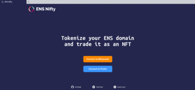
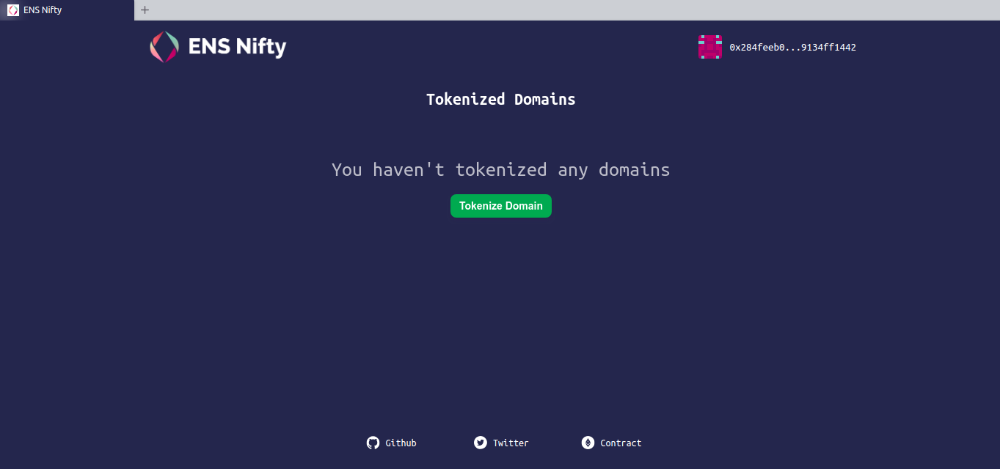
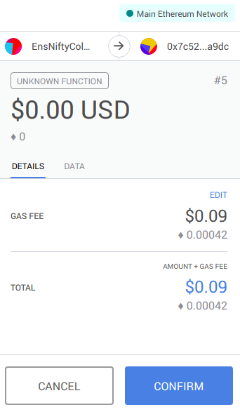

## ENS meetup Ethereum Sevilla
Repositorio para el workshop del [meetup de Ethereum Sevilla](https://secure.meetup.com/es/register/?ctx=ref) sobre [ENS](https://ens.domains/), y como tokenizar nuestro dominio con [ENS Nifty](https://ensnifty.com/), asi podemos intercambiar el dominio o delegarlo a otra wallet.

> La parte de usar la App de MyCrypto es opcional, podemos usar cualquier gestor de carteras de Ethereum

Para registrar nuestro dominio en [ENS](https://ens.domains/) vamos a usar [MyCrypto](https://mycrypto.com/). Para ello nos vamos a su página o usamos su aplicación. Para este workshop he decidido usar la aplicación que podemos descargar desde su [GitHub](https://github.com/MyCryptoHQ/MyCrypto/releases). La versión 1.4.0 es la última a día de hoy.

Para mi caso particular (Linux 64 bits) me descargo el archivo con extensión [.AppImage](https://github.com/MyCryptoHQ/MyCrypto/releases/download/1.4.0/linux-x86-64_1.4.0_MyCrypto.AppImage) correspondiente.
 Un _“.AppImage”_ es un formato de software portable, por lo que no se requiere instalación sino que podemos pasar directamente a su ejecución bien usando el ratón o la propia terminal. Hay que darle permisos de ejecución antes de intentar cualquiera de las dos formas.

 ```
 $ chmod a+x linux-x86-64_1.4.0_MyCrypto.AppImage  # Cambiamos permisos
 $ ./linux-x86-64_1.4.0_MyCrypto.AppImage          # Ejecutamos MyCrypto
 ```


Una vez abierto vemos la aplicación de MyCrypto y podemos proceder a crear una nueva wallet para usarla con ENS. Vamos a la opción del centro _“Create New Wallet”_ y seleccionamos _“Generate a Wallet”_.


Para este caso voy a usar la opción _“Keystore File”_.


Introducimos una contraseña que sea segura y hacemos clic en _“Create New Wallet”_.


Descargamos el archivo en _“Download Keystore File”_ y continuamos. En la siguiente pantalla nos saldrá información sobre nuestra wallet, como la clave privada, la imagen para el _“Paper Wallet”_ por si queremos descargarla y tenerlo apuntado en un papel.


Una vez creada la wallet y con los datos guardados vamos a proceder a usarla. Para ello nos vamos a la página principal de la aplicación de MyCrypto (“View & Send”) y seleccionamos la opción _“Keystore File”_.


Vamos a comprobar que la dirección de ENS que queremos esté disponible. Para ello en la aplicación de MyCrypto seleccionamos _“ENS”_, introducimos el dominio en el cual estamos interesados y hacemos clic en _“Check Availability”_.


Para este ejemplo comprobamos que _“colmenacowork.eth”_ esté disponible, así que hacemos clic en _“Open an auction on MyCrypto v3!”_ que nos llevará a la página de MyCrypto. Repetimos los pasos de introducir el nombre y comprobar que esté libre. Más abajo podemos ver las opciones para acceder a nuestra wallet. Como en pasos anteriores, seleccionamos la opción que deseemos y desbloqueamos nuestra cartera.


Nos aparece un formulario con varios datos modificables. Una vez ajustados (para este caso los dejaré tal como están) hacemos clic en _“Start the Auction”_.


Podemos ver que la siguiente imagen nos da información importante como el día que debemos revelar la oferta, el día que finaliza la subasta y más información. Para confirmar la operación hacemos clic en _“Yes, I am sure! Make transaction”_ **es importante copiar los datos que están dentro de _"Copy and save this"_, pues nos haran falta en un paso posterior**.


Comprobamos en un [explorador de bloques](https://etherscan.io/) que nuestra transacción se ha realizado correctamente sin ningún error.


Después, debemos esperar el tiempo mínimo para revelar nuestra oferta (3 días). Una vez que ha pasado este tiempo abrimos la pagina de MyCrypto, hacemos clic en `“TOOLS” > “ENS Domains”`, introducimos nuestro dominio, nos redirige a la página [legacy de MyCrypto](https://legacy.mycrypto.com/) y desbloqueamos nuestra wallet.
Una vez desbloqueada, debemos introducir en el espacio `“Long string of text you copied”` el texto copiado y hacemos clic en _“Reveal your Bid”_


Cuando hayan pasado los días necesarios podemos entrar en [MyCrypto](https://mycrypto.com/ens) introducir nuestro dominio y veremos que ya es nuestro.


Si hemos seguido estos pasos ya tenemos nuestro dominio `.ens`, asi que desde ahora en lugar de tener que acordarnos de esa dirección tan larga ~~de la que nadie se acuerda~~ sólo debemos recordar el nombre que hemos seleccionado. **Ese nombre será nuestra dirección de Ethereum**.

## Ahora vamos a proceder a tokenizar nuestro dominio
[ENS Nifty](https://ensnifty.com/) nos sirve para tokenizar nuestros dominios de ENS como si fueran tokens ERC-721, de esta manera podemos pasar o transferir más fácilmente nuestro dominio a otra wallet.

En esta ocasión voy a usar el complemento de [Metamask](https://metamask.io/) para [Brave](https://brave.com/) (disponible también en [Firefox](https://addons.mozilla.org/en-US/firefox/addon/ether-metamask/) y [Chrome](https://chrome.google.com/webstore/detail/metamask/nkbihfbeogaeaoehlefnkodbefgpgknn)). Debemos importar la clave privada generada anteriormente. Una vez que estamos logueados en Metamask hacemos clic en _”Import Account”_, seleccionamos _”Private key”_, pegamos en el recuadro correspondiente la clave privada de nuestra cuenta generada al comienzo del workshop y hacemos clic en _”Import”_.


Ya tenemos nuestra wallet importada en el complemento de Metamask.


Una vez que tenemos la sesión iniciada en el complemento de Metamask, abrimos la página de ensnifty y hacemos clic en _”Connect to Metamask”_.



Como vemos nos dice que no tenemos tokenizados ningún dominio, así que hacemos clic en _”Tokenize Domain”_.



Introducimos en el recuadro nuestro dominio y hacemos clic en _”Submit”_ (**es importante poner el .eth, si no nos dará un error**). Los dos pasos que aparecen bajo el recuadro se realizaran de forma transparente para nosotros como resultado de transacciones que nos solicitará automáticamente Metamask mediante notificaciones.


Primera notificación con los valores aproximados para la transacción que queremos hacer. No voy a modificar ningún valor.


Una vez que esa transacción se haya realizado sin problemas Metamask tendrá una segunda notificación (como antes no voy a modificar los valores). Hacemos clic en ella y aceptamos.



Cuando estas transacciones haya finalizado podemos ver ambas operaciones confirmadas en la página.


Si refrescamos la página y volvemos a hacer clic en _”Connect to Metamask”_ podemos ver que ya tenemos nuestro **dominio tokenizado**. Si además abrimos nuestra wallet en un explorador de bloques nos aparecerá un **token**.

A partir de este momento si algún día tenemos que mandarlo a otra wallet o queremos regalárselo a otra persona podemos transferirlo muy fácilmente.

>Espero que esta guía les sirva de ayuda.
